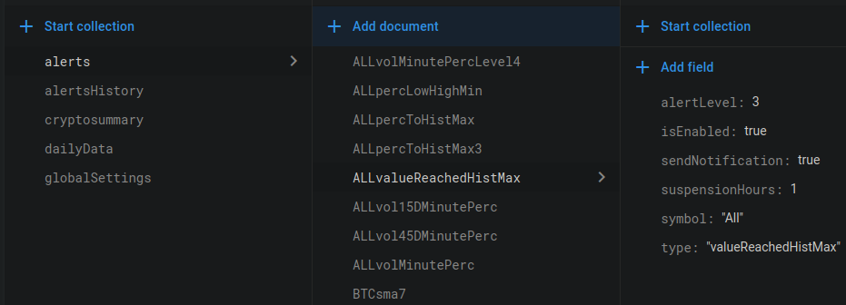
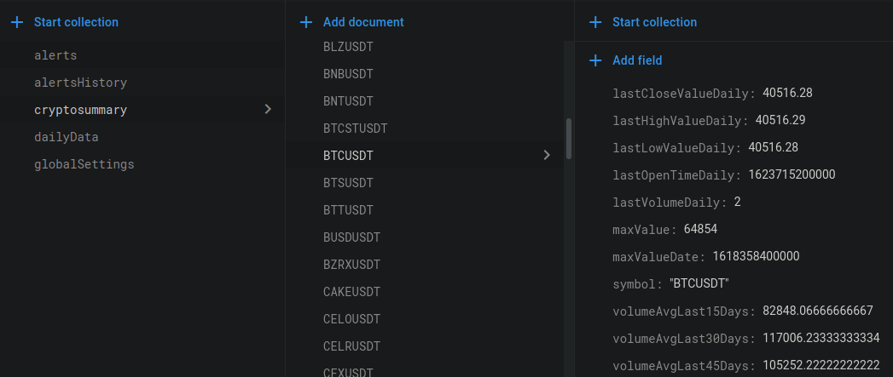
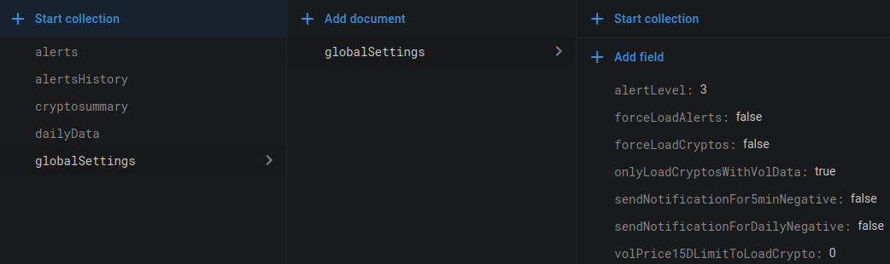

# binancepoller

The goal of having this repository is not (for now) to provide a working application as this would envolve having scripts that would create all the DB schema, this can be added in the future if needed.
The goal is publish the code and give a global understanding of how it works.
All decisions, specially code structure were taken considering having a free poller using Google cloud services.

Below, some table examples to have a better understanding of the DB.

## "alerts" collection 
It stores all alert definition for which we want to run them. They can be for a specific currency of for "All"


## "cryptosummary" collection 
It stores all asset information + lastUpdated info like lastValue etc.


## "globalSettings" collection 
It is used to control some app settings without needing to restart or re-deploy the app


## Global summary of the app

The app basically polls minute data from Binance every minute, runs a list of alerts for each cryptocurrency (like if volume is bigger than 1month volume average or if last currency value enters within x% of the historical highest value, etc) and if an alert is triggered it sends a message to a slack channel.

The main part and starting point is the scheduled function that runs every minute:
```
exports.scheduledFunction = functions.pubsub
    .schedule("* * * * *").onRun(async (context) => {
      const result = await mainPollMinute();
      console.log(JSON.stringify(result));
    });
```
